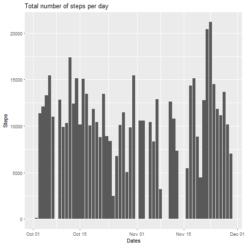
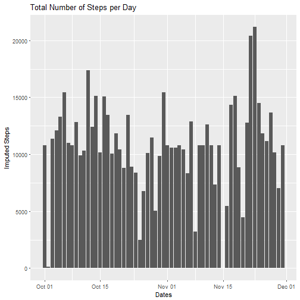
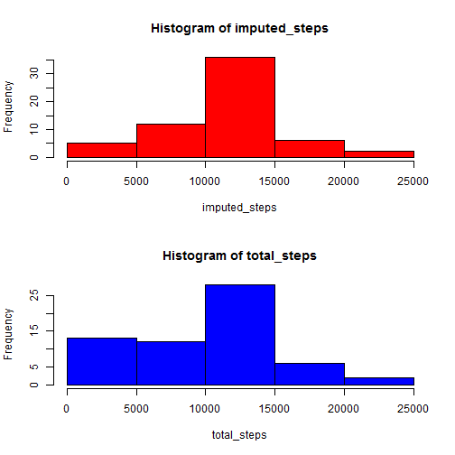

# **Show any code that is needed to load the data**  

```r
setwd("~/School/Coursera")
rm(list = ls())
activity <- read.csv("activity.csv", colClasses = c("numeric", "character", "integer"))
```

# **Process the data into a format suitable for your analysis**  


```r
library(plyr)
```

```
## Warning: package 'plyr' was built under R version 3.3.2
```

```r
library(dplyr)
```

```
## Warning: package 'dplyr' was built under R version 3.3.2
```

```
## 
## Attaching package: 'dplyr'
```

```
## The following objects are masked from 'package:plyr':
## 
##     arrange, count, desc, failwith, id, mutate, rename, summarise,
##     summarize
```

```
## The following objects are masked from 'package:stats':
## 
##     filter, lag
```

```
## The following objects are masked from 'package:base':
## 
##     intersect, setdiff, setequal, union
```

```r
library(lubridate)
```

```
## Warning: package 'lubridate' was built under R version 3.3.2
```

```
## 
## Attaching package: 'lubridate'
```

```
## The following object is masked from 'package:plyr':
## 
##     here
```

```
## The following object is masked from 'package:base':
## 
##     date
```

```r
library(ggplot2)
```

```
## Warning: package 'ggplot2' was built under R version 3.3.2
```

```
## Need help getting started? Try the cookbook for R:
## http://www.cookbook-r.com/Graphs/
```

```r
total_steps <- tapply(activity$steps, activity$date, FUN = sum, na.rm = TRUE)
activity$date <- ymd(activity$date)
```
# **Part One**  
### **What is the mean total number of steps taken per day?**  

```r
mean(total_steps)
```

```
## [1] 9354.23
```

```r
median(total_steps)
```

```
## [1] 10395
```
### **Calculate the total number of steps taken per day**

```r
steps <- activity %>%
  filter(!is.na(steps)) %>%
  group_by(date) %>%
  summarize(steps = sum(steps)) %>%
  print
```

```
## # A tibble: 53 × 2
##          date steps
##        <date> <dbl>
## 1  2012-10-02   126
## 2  2012-10-03 11352
## 3  2012-10-04 12116
## 4  2012-10-05 13294
## 5  2012-10-06 15420
## 6  2012-10-07 11015
## 7  2012-10-09 12811
## 8  2012-10-10  9900
## 9  2012-10-11 10304
## 10 2012-10-12 17382
## # ... with 43 more rows
```
### **Make a histogram of the total number of steps taken each day**  

```r
ggplot(steps, aes(x = date, y = steps)) + geom_histogram(stat = "identity") + xlab("Dates") + ylab("Steps") + labs(title = "Total number of steps per day")
```

```
## Warning: Ignoring unknown parameters: binwidth, bins, pad
```



# **Part Two**
### **What is the average daily activity pattern?**  

```r
daily <- activity %>%
  filter(!is.na(steps)) %>%
  group_by(interval) %>%
  summarize(steps = mean(steps)) %>%
  print
```

```
## # A tibble: 288 × 2
##    interval     steps
##       <int>     <dbl>
## 1         0 1.7169811
## 2         5 0.3396226
## 3        10 0.1320755
## 4        15 0.1509434
## 5        20 0.0754717
## 6        25 2.0943396
## 7        30 0.5283019
## 8        35 0.8679245
## 9        40 0.0000000
## 10       45 1.4716981
## # ... with 278 more rows
```
### **Make a time series plot of the 5-minute interval and the average number of steps taken, averaged across all days**  

```r
plot(daily, type = "l")
```


### **Which 5-minute interval, on average across all the days in the dataset, contains the max number of steps?**  

```r
daily[which.max(daily$steps),]$interval
```

```
## [1] 835
```
### **Imputing missing values**  
### Calculate and report the total number of missing values in the dataset  

```r
missing <- sum(is.na(activity))
missing
```

```
## [1] 2304
```
### **Create a new dataset that is equal to the original dataset but with the missing data filled in**  

```r
filled <- activity %>%
  group_by(interval) %>%
  mutate(steps = ifelse(is.na(steps), mean(steps, na.rm = TRUE), steps))
summary(filled)
```

```
##      steps             date               interval     
##  Min.   :  0.00   Min.   :2012-10-01   Min.   :   0.0  
##  1st Qu.:  0.00   1st Qu.:2012-10-16   1st Qu.: 588.8  
##  Median :  0.00   Median :2012-10-31   Median :1177.5  
##  Mean   : 37.38   Mean   :2012-10-31   Mean   :1177.5  
##  3rd Qu.: 27.00   3rd Qu.:2012-11-15   3rd Qu.:1766.2  
##  Max.   :806.00   Max.   :2012-11-30   Max.   :2355.0
```
### **Make a histogram of the total number of steps taken each day**  

```r
new_steps <- filled %>%
  group_by(date) %>%
  summarize(steps = sum(steps)) %>%
  print
```

```
## # A tibble: 61 × 2
##          date    steps
##        <date>    <dbl>
## 1  2012-10-01 10766.19
## 2  2012-10-02   126.00
## 3  2012-10-03 11352.00
## 4  2012-10-04 12116.00
## 5  2012-10-05 13294.00
## 6  2012-10-06 15420.00
## 7  2012-10-07 11015.00
## 8  2012-10-08 10766.19
## 9  2012-10-09 12811.00
## 10 2012-10-10  9900.00
## # ... with 51 more rows
```

```r
ggplot(new_steps, aes(x = date, y = steps)) + geom_histogram(stat = "identity") + xlab("Dates") + ylab("Imputed Steps") + labs(title = "Total Number of Steps per Day")
```

```
## Warning: Ignoring unknown parameters: binwidth, bins, pad
```



### **Calculate and report the mean and median total number of steps taken per day**  

```r
imputed_steps <- tapply(filled$steps, filled$date, FUN = sum, na.rm = TRUE)
filled$date <- ymd(filled$date)
mean(imputed_steps)
```

```
## [1] 10766.19
```

```r
median(imputed_steps)
```

```
## [1] 10766.19
```
### **Do these values differ from the estimates from the first part of the assignment?**  

```r
mean(total_steps) == mean(imputed_steps)
```

```
## [1] FALSE
```

```r
median(total_steps) == median(imputed_steps)
```

```
## [1] FALSE
```

```r
summary(total_steps)
```

```
##    Min. 1st Qu.  Median    Mean 3rd Qu.    Max. 
##       0    6778   10400    9354   12810   21190
```

```r
summary(imputed_steps)
```

```
##    Min. 1st Qu.  Median    Mean 3rd Qu.    Max. 
##      41    9819   10770   10770   12810   21190
```
###**What is the impact of imputing missing data on the estimates of the total daily number of steps?**

```r
summary(imputed_steps) - summary(total_steps)
```

```
##    Min. 1st Qu.  Median    Mean 3rd Qu.    Max. 
##      41    3041     370    1416       0       0
```

```r
par(mfrow = c(2, 1))
hist(imputed_steps, col = "red")
hist(total_steps, col = "blue")
```



# **Part 3**  

### **Are there differences in activity patterns between weekdays and weekends?**

```r
dofw <- function(date) {
  if (weekdays(as.Date(date)) %in% c("Saturday", "Sunday")){
    "weekend"
  } else {
    "weekday"
  }
}
filled$daytype <- as.factor(sapply(filled$date, dofw))
```
###**Make a panel plot containing a time series plot of the 5-minute interval and the average number of steps taken, averaged across all weekday days or weekend days**  

```r
par(mfrow = c(2, 1))
for (type in c("weekend", "weekday")) {
  steps_type <- aggregate(steps ~ interval, data = filled, subset = filled$daytype == type, FUN = mean)
  plot(steps_type, type = "l", main = type)
}
```


